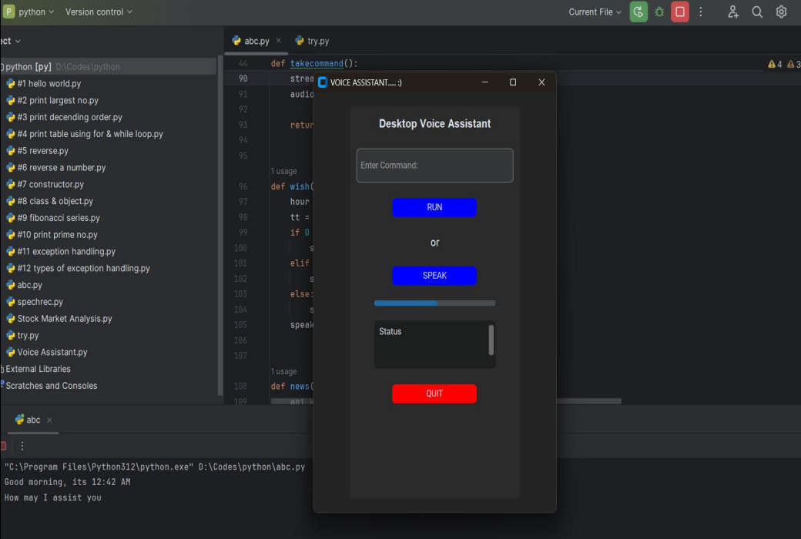

# 🧠 AI-Powered Desktop Voice Assistant

A feature-rich Python-based voice assistant with a modern GUI built using `CustomTkinter`. It understands voice/text commands and performs a wide range of tasks — from searching the web, telling jokes, sending emails, giving weather updates, to chatting with Gemini AI.

!GUI Screenshot 

## ✨ Features

✅ Voice & text command support  
✅ Gemini AI integration for intelligent replies  
✅ Real-time weather information  
✅ News from TechCrunch  
✅ Wikipedia summary search  
✅ Google search  
✅ YouTube playback  
✅ Email sender via Gmail SMTP  
✅ Reminder system  
✅ Joke generator  
✅ Screenshot capture  
✅ Notepad auto-write  
✅ Quotes scraper (from web)  
✅ GUI with buttons, status bar & quit  
✅ Power control (shutdown, sleep, restart)

---

## 🖥️ GUI Preview

The GUI is built using `CustomTkinter` and includes:
- Entry field for manual commands
- “RUN” and “SPEAK” buttons
- Status log area
- Quit button

---

## 🚀 Technologies Used

| Tech             | Description                                      |
|------------------|--------------------------------------------------|
| `Python`         | Core programming language                        |
| `CustomTkinter`  | Modern UI for desktop                            |
| `SpeechRecognition` + `PyAudio` | Voice input                        |
| `pyttsx3`        | Text-to-speech conversion                        |
| `pywhatkit`      | YouTube playback                                 |
| `wikipedia`      | Search & summary                                 |
| `smtplib`        | Email sending via Gmail                          |
| `requests`       | API calls for weather/news                       |
| `bs4`            | Web scraping quotes                              |
| `pyautogui`      | Screenshot feature                               |
| `pyjokes`        | Funny jokes                                      |
| `Gemini API`     | AI-powered chat replies                          |

---

## 🗣️ Supported Commands

Command	Action
-open notepad	Opens Notepad and writes to file

-open wikipedia	Searches Wikipedia

-open control panel	Opens Control Panel

-take a screenshot	Captures and saves screenshot

-play music	Plays a random song from folder

-tell me a joke	Says a random joke

-tell me news / news	Speaks 5 headlines from TechCrunch

-extract phrases	Scrapes quotes from a website

-play youtube	Plays video from YouTube

-search google for	Opens Google search

-send email	Sends email via voice

-weather	Gets weather info by city

-set reminder	Sets reminder after X minutes

-power	Shutdown / Restart / Sleep

-thanks or quit it	Exits the assistant

-Anything else will be handled by Gemini AI Chat 💬

---

## 🔐 API Keys Used

-OpenWeatherMap API – for weather

-NewsAPI – for tech news

-Gemini API – for AI chat response

-Make sure to replace these with your own API keys in the code.

## 📦 To Do / Future Scope

-Voice authentication

-Continuous listening mode

-Chat memory using local storage

-Daily news briefing

-Better UI animations & themes
